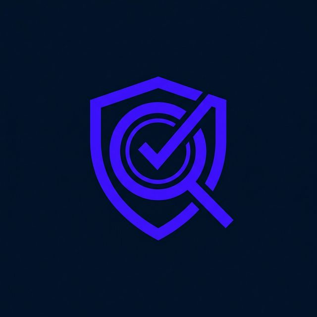

<div align="center">
  
  <h1>AuditLens</h1>
  <p>The agentic compliance engine.</p>
  
  <p>
    <a href="https://opensource.org/licenses/MIT"></a>
    <a href="CONTRIBUTING.md"></a>
  </p>
  
  <p align="center">
    <a href="#quick-start">Quick Start</a> •
    <a href="#how-it-works">How It Works</a> •
    <a href="#supported-frameworks">Frameworks</a> •
    <a href="#multi-agent-support">Multi-Agent</a> •
    <a href="CONTRIBUTING.md">Contributing</a>
  </p>
</div>

---

## What is AuditLens?

AuditLens is an **agent skill** — expert instructions and framework references that turn any AI agent into a precision compliance auditor.

No keyword matching. No heuristics. Your AI agent reads your documents, reasons about their content against regulatory frameworks, and produces auditor-grade gap analysis, maturity scoring, and interactive audit workspaces.

## Quick Start

### Claude Code

```bash
/plugin marketplace add adhit-r/audit-lens
```

### Any Other Agent

```bash
git clone https://github.com/adhit-r/audit-lens.git
```

Then copy `skill/` into your agent's skill directory. See [Multi-Agent Support](#multi-agent-support) for platform-specific paths.

### Start Auditing

Once installed, ask your agent:

```
"Audit my evidence folder against ISO 27001"
"Check our SOC 2 readiness"
"Score this vendor's SIG questionnaire"
```

## How It Works

AuditLens is **not a standalone tool** — it's intelligence that lives inside your AI agent.

```
┌────────────┐     ┌─────────────────────┐     ┌──────────────┐
│ Your Docs  │ ──→ │ AI Agent + AuditLens│ ──→ │ Audit Report │
│ (evidence) │     │ (reads & reasons)   │     │ (HTML/JSON)  │
└────────────┘     └─────────────────────┘     └──────────────┘
```

The agent:
1. **Reads** your organizational documents (policies, procedures, logs, configs)
2. **References** the framework control catalogs (ISO 27001, SOC 2, etc.)
3. **Maps** each document to specific controls with evidence strength ratings
4. **Identifies gaps** — controls with missing, weak, or stale evidence
5. **Scores maturity** — CMMI-aligned 1-5 per control domain
6. **Generates** an interactive audit workspace (self-contained HTML)

## Supported Frameworks

| Framework | Controls | Reference |
|-----------|----------|-----------|
| ISO 27001:2022 | 93 Annex A controls | `skill/references/iso27001.md` |
| SOC 2 Type II | 61 trust service criteria | `skill/references/soc2.md` |
| HIPAA | 46 safeguard specifications | `skill/references/hipaa.md` |
| NIST CSF 2.0 | 22 categories | `skill/references/nist_csf.md` |
| PCI DSS v4.0 | Payment card requirements | `skill/references/pci_dss.md` |
| GDPR | Data protection articles | `skill/references/gdpr.md` |

Cross-framework mapping via `skill/references/crosswalk.md`.

## Multi-Agent Support

AuditLens works with any AI agent that can read files and follow instructions.

| Platform | Install |
|----------|---------|
| **Claude Code** | `/plugin marketplace add adhit-r/audit-lens` |
| **Antigravity** | `cp -r skill/ .agents/skills/auditlens/` |
| **Gemini** | Paste `skill/SKILL.md` into System Instructions |
| **ChatGPT** | Paste `skill/SKILL.md` into Custom GPT Instructions, upload `skill/references/` to Knowledge |
| **Copilot** | Append context from `skill/SKILL.md` to `.github/copilot-instructions.md` |

Detailed guides: [Antigravity](compatibility/antigravity.md) · [Gemini](compatibility/gemini.md) · [ChatGPT](compatibility/chatgpt.md) · [Copilot](compatibility/copilot.md)

## Enterprise Connectors

AuditLens can pull evidence directly from cloud platforms when connectors are available:

- **Google Workspace** — Drive, Gmail, Calendar, Sheets via `gws` CLI
- **Microsoft 365** — SharePoint, OneDrive, Entra ID, Purview via `m365` CLI

The skill auto-detects available connectors at runtime.

## GitHub Action

Add compliance checks to your CI:

```yaml
- uses: adhit-r/audit-lens@v2
  with:
    evidence_dir: './compliance-docs'
    framework: 'iso27001'
```

## Interactive Workspace Demo

> [!NOTE]
> **Live Demo**: [adhit-r.github.io/audit-lens](https://adhit-r.github.io/audit-lens)

## Repository Structure

```
audit-lens/
├── skill/                    ← The agent skill
│   ├── SKILL.md              ← Agent instructions
│   ├── references/           ← 8 framework control catalogs
│   └── assets/               ← HTML audit workspace template
├── .claude-plugin/           ← Claude Code plugin manifest
├── compatibility/            ← Per-agent install guides
├── action.yml                ← GitHub Action
└── demo/                     ← Live demo
```

Zero code. Pure content. The agent is the intelligence.

## Contributing

See [Contributing Guide](CONTRIBUTING.md).

---

<p align="center">
  Developed by <a href="https://github.com/AdhithyaRajasekaran">Adhithya Rajasekaran</a>
</p>
